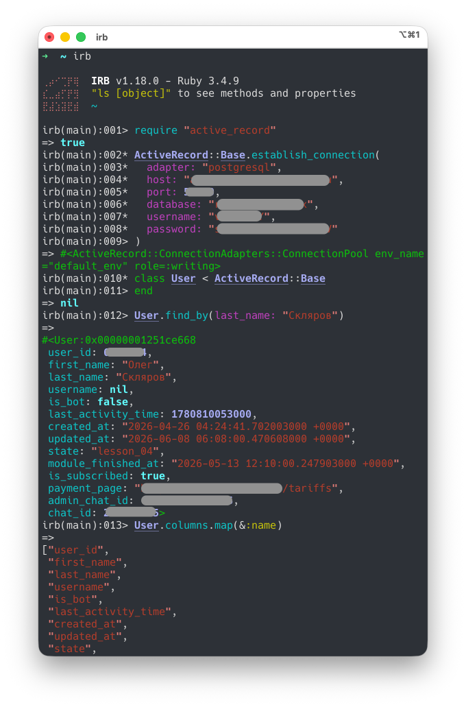

# Практика Active Record — ORM из Rails без Rails

Сегодня попробовал использовать Active Record вне Rails-приложения. Цель — работать с PostgreSQL без написания SQL-запросов вручную.

Для этого достаточно установить два гема:

```sh
gem install activerecord
gem install pg
```

Запускаем irb и подключаемся к БД:

```ruby
require "active_record"

ActiveRecord::Base.establish_connection(
  adapter: "postgresql",
  host: "localhost",
  database: "mydb",
  username: "user",
  password: "secret"
)
```

## Zero-configuration модель

Создаем класс без единой строчки настроек:

```ruby
class User < ActiveRecord::Base
end
```

Если в БД существует таблица `users`, Active Record автоматически:

- найдет таблицу;
- прочитает её структуру;
- определит типы колонок;
- создаст методы доступа к полям.

На скриншоте видно, что пустой класс уже умеет получать структуру таблицы и выполнять запросы к PostgreSQL.



## Изучаем структуру таблицы

ORM:

```ruby
User.column_names
User.columns.map { |c| [c.name, c.type] }
```

SQL:

```sql
SELECT column_name, data_type
FROM information_schema.columns
WHERE table_name = 'users';
```

## Поиск записей

ORM:

```ruby
User.find_by(last_name: "Ivanov")
User.where(last_name: "Ivanov")
```

SQL:

```sql
SELECT *
FROM users
WHERE last_name = 'Ivanov';
```

Посмотреть сгенерированный SQL:

```ruby
User.where(last_name: "Ivanov").to_sql
```

## Вставка данных

ORM:

```ruby
user = User.new(
  first_name: "Ivan",
  last_name: "Ivanov"
)
user.save
```

или короче:

```ruby
User.create!(
  first_name: "Ivan",
  last_name: "Ivanov"
)
```

SQL:

```sql
INSERT INTO users(first_name, last_name)
VALUES ('Ivan', 'Ivanov');
```

## Где живет TCP-соединение?

Подключение создается через:

```ruby
ActiveRecord::Base.establish_connection(...)
```

Соединение не хранится в объекте User.

Структура выглядит примерно так:

```text
User
  ↓
ActiveRecord::Base
  ↓
ConnectionPool
  ↓
PostgreSQLAdapter
  ↓
PG::Connection
  ↓
TCP socket
```

Посмотреть текущее соединение:

```ruby
ActiveRecord::Base.connection
```

Нативное соединение PostgreSQL:

```ruby
ActiveRecord::Base.connection.raw_connection
```

## Что такое пул соединений?

Active Record использует пул соединений.

Посмотреть его состояние:

```ruby
ActiveRecord::Base.connection_pool.stat
```

Пример результата:

```ruby
{
  size: 5,
  connections: 1,
  busy: 0,
  idle: 1
}
```

Идея проста: вместо постоянного открытия и закрытия TCP-соединений используется небольшой набор уже открытых соединений.

В веб-приложении это позволяет многим потокам быстро выполнять запросы к БД.

## Как закрыть соединение?

Закрыть все соединения пула:

```ruby
ActiveRecord::Base.connection_pool.disconnect!
```

Удалить конфигурацию подключения полностью:

```ruby
ActiveRecord::Base.remove_connection
```

Посмотреть активные подключения со стороны PostgreSQL:

```sql
SELECT pid, usename, state
FROM pg_stat_activity;
```

## Выводы

После многих лет работы через SQL подход Active Record выглядит непривычно.

Вместо:

```sql
SELECT *
FROM users
WHERE last_name = 'Ivanov';
```

получаем:

```ruby
User.where(last_name: "Ivanov")
```

Вместо описания структуры таблиц в коде Active Record сам изучает схему БД и генерирует методы на лету.

Главный плюс — код практически не зависит от конкретной СУБД. PostgreSQL, SQLite, MySQL и другие поддерживаемые базы данных используют один и тот же интерфейс ORM.

При работе напрямую через SQL приходится знать особенности конкретной СУБД: типы данных, синтаксис запросов, диалекты SQL, особенности драйверов.

С ORM большая часть этих различий скрыта за единым API.

Для исследовательской работы через REPL связка irb + ActiveRecord + PostgreSQL оказалась неожиданно удобной и позволяет быстро изучать данные и структуру существующей базы без полноценного Rails-приложения.
